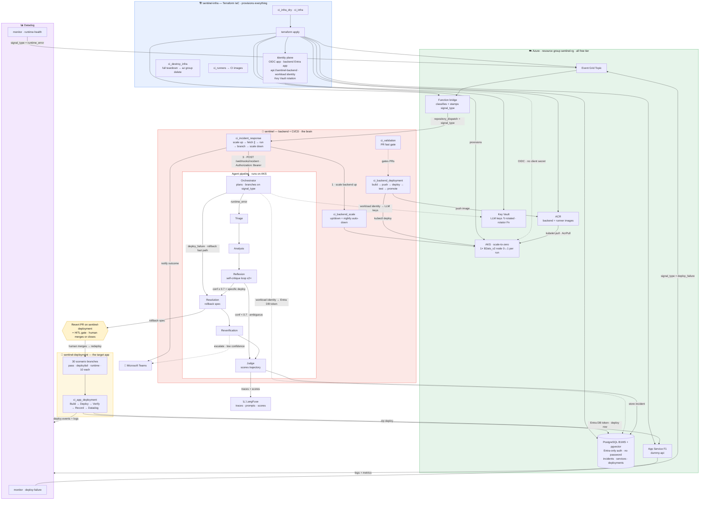
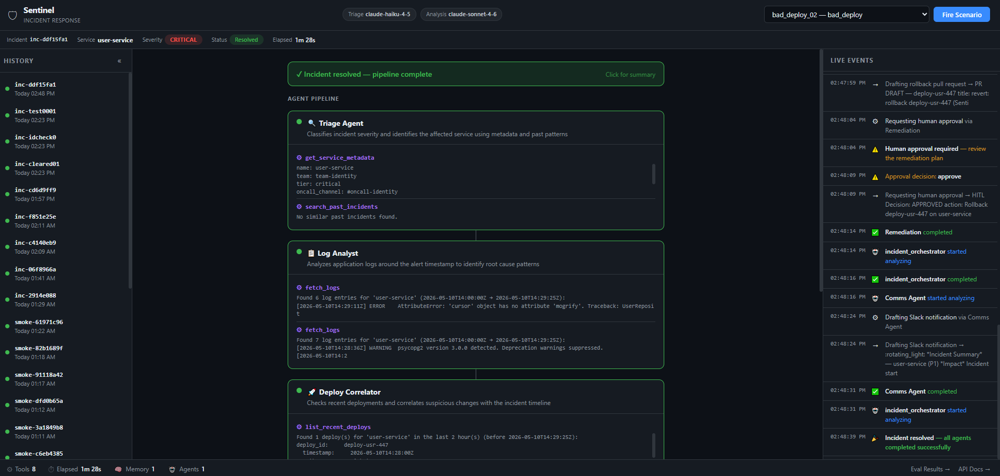

# Sentinel

> [!IMPORTANT]
> ### 🚧 Phase 2 is under active construction
> Sentinel is being rebuilt as a **cloud-native, multi-repo system** on Azure — an AKS
> scale-to-zero backend, Terraform IaC, real Datadog signal from 30 ground-truth scenario
> branches, and **passwordless Entra security end-to-end** (OIDC, workload identity, bearer
> tokens). The README below documents the **Phase 1 MVP**; Phase 2 spans three repos:
>
> | Repo | Role | Link |
> |------|------|------|
> | **Sentinel** _(this repo · default branch)_ | Multi-agent backend + CI/CD — the brain | **https://github.com/Keshav0375/Sentinel** |
> | **Sentinel-infra** | Terraform IaC + identity plane | **https://github.com/Keshav0375/Sentinel-infra** |
> | **Sentinel-deployment** | Target app + 30 scenario branches (ground truth) | **https://github.com/Keshav0375/Sentinel-deployment** |
>
> **The diagram below is the architectural view of Phase 2** — every repo, request, flow, auth
> edge, and CI/CD pipeline in one picture.

## 🏗️ Phase 2 — Full Architecture (every request · flow · pipeline)



_This is the architectural view of Phase 2._ Deep-dive docs live in
[`Planning/Phase-2/ARCHITECTURE.md`](Planning/Phase-2/ARCHITECTURE.md) (the architecture index).

---

**Autonomous DevOps incident response agent** — multi-agent pipeline that triages alerts, diagnoses root causes, drafts remediation plans, and communicates status, with a mandatory human-approval gate before any destructive action.

Built as a portfolio project demonstrating production-grade agentic engineering: multi-agent orchestration, HITL safety, episodic memory, trajectory evaluation, and real-time observability.

---

## How It Works

```
Alert fires
    │
    ▼
┌─────────────────────────────────────────────────────────────┐
│                      Orchestrator Agent                      │
│  (coordinates handoffs, enforces 15-call cap, writes STM)   │
└──┬──────────┬──────────┬──────────┬──────────┬─────────────┘
   │          │          │          │          │
   ▼          ▼          ▼          ▼          ▼
Triage    Log      Deploy    Remediation  Comms
Agent   Analyst  Correlator   Agent      Agent
   │       │          │          │          │
   │    fetch_     list_      draft_    draft_
get_    logs    recent_   rollback_  slack_
service_         deploys      pr     summary
metadata                       │
search_                 request_human_
past_                   approval ◄── HITL gate
incidents                      │
                               ▼
                        Human approves / rejects
                               │
                               ▼
                     Incident resolved + stored
                     in episodic memory
```

Every tool call is captured as a trajectory. After resolution, an LLM judge scores the trajectory across 6 dimensions and writes a report viewable in the web dashboard.

---

## Features

- **Multi-agent pipeline** — 5 specialist agents (Triage, Log Analyst, Deploy Correlator, Remediation, Comms) orchestrated via OpenAI Agents SDK handoffs
- **HITL safety gate** — `request_human_approval` is the only path to destructive actions; no agent can bypass it
- **Episodic memory** — past incidents embedded and stored in SQLite; similar incidents surface automatically during triage
- **Semantic memory** — service map, dependency graph, and runbooks loaded from seed data
- **Live incident dashboard** — real-time SSE stream of agent activity at `http://localhost:8000/`; approve/reject HITL from the browser
- **Trajectory eval** — LLM-as-judge scores every incident across 6 dimensions (0–5), with a Markdown and JSON report
- **Eval results dashboard** — browse per-scenario scores at `http://localhost:8000/eval`
- **10 synthetic scenarios** — 5 failure classes (bad deploy, DB pool, downstream outage, memory leak, config regression)

---

## Quick Start

### Prerequisites

- Python 3.12+
- [Groq API key](https://console.groq.com/keys) (free tier is sufficient)
- Docker + docker-compose (optional but recommended)

### 1. Clone and configure

```bash
git clone https://github.com/keshxv/sentinel.git
cd sentinel
cp .env.example .env
# Edit .env — add your GROQ_API_KEY
```

### 2a. Run with Docker

```bash
docker-compose up --build
```

Dashboard: [http://localhost:8000](http://localhost:8000)

### 2b. Run without Docker

```bash
python -m venv .venv
source .venv/bin/activate          # Windows: .venv\Scripts\activate
pip install -e ".[dev]"
python -m data.seed                # seed service map + runbooks
uvicorn sentinel.main:app --reload
```

Dashboard: [http://localhost:8000](http://localhost:8000)

### 3. Switch providers (optional)

Model strings use the `provider/model` format. Swap any provider with 3 env vars — no code changes.

**Switch analysis to Anthropic Claude:**
```env
SENTINEL_ANALYSIS_MODEL=anthropic/claude-sonnet-4-6
ANTHROPIC_API_KEY=sk-ant-...
```

**Switch everything to OpenAI:**
```env
SENTINEL_TRIAGE_MODEL=openai/gpt-4o-mini
SENTINEL_ANALYSIS_MODEL=openai/gpt-4o
SENTINEL_JUDGE_MODEL=openai/gpt-4o-mini
OPENAI_API_KEY=sk-...
```

See [available_models.md](available_models.md) for the full model table and provider capability matrix.

### 4. Fire a scenario

**From the dashboard** — select a scenario from the dropdown and click ⚡ Fire Scenario.

**From the CLI**:

```bash
python scripts/run_scenario.py bad_deploy_01
python scripts/run_scenario.py --list   # see all 10 scenarios
```

### 5. Run the eval suite

```bash
python scripts/run_eval.py
# or a subset:
python scripts/run_eval.py --scenarios bad_deploy_01 db_pool_01
```

Results → `reports/eval_report.json` + `reports/eval_report.md`  
Dashboard → [http://localhost:8000/eval](http://localhost:8000/eval)

---

## Demo

> _Loom recording coming soon._

**What you'll see:**

1. Select `bad_deploy_01` from the dropdown — a critical API gateway alert fires
2. Watch the five agent cards light up in sequence as each specialist completes its analysis
3. An amber HITL overlay appears when the Remediation Agent requests rollback approval
4. Click ✅ Approve — the pipeline continues and the incident resolves
5. Switch to `/eval` to see the LLM judge's per-dimension scores

---

## Tech Stack

| Layer | Technology |
|-------|-----------|
| Agent framework | [openai-agents](https://github.com/openai/openai-agents-python) (Agents SDK) |
| LLM | LiteLLM multi-provider — `groq/`, `openai/`, `anthropic/`, `azure/` via `provider/model` env var. Default: Groq (free tier). See [available_models.md](available_models.md). |
| API layer | FastAPI + uvicorn |
| Memory — episodic | SQLite via aiosqlite + cosine similarity |
| Memory — semantic | SQLite (service map, runbooks) |
| Embeddings | sentence-transformers `all-MiniLM-L6-v2` (local, 384 dims, zero cost) |
| Real-time | Server-Sent Events (`EventSource` API) |
| Models / validation | Pydantic v2 |
| Config | pydantic-settings |
| Logging | structlog (JSON) |
| HTTP client | httpx |
| Containerisation | Docker + docker-compose |
| Linting | ruff |
| Type checking | pyright |
| Tests | pytest + pytest-asyncio |

---

## Eval Results

> _Run `python scripts/run_eval.py` to generate scores. Results will appear at `/eval`._

**Eval dimensions (scored 0–5 by the judge):**

| Dimension | What it measures |
|-----------|-----------------|
| `triage_accuracy` | Right service + correct severity? |
| `root_cause_correctness` | Hypothesis matches known root cause? |
| `tool_efficiency` | Right tools in logical order? No redundant calls? |
| `mttr` | Time from alert to remediation proposal (lower is better) |
| `remediation_safety` | HITL gate used? Proposed fix appropriate? |
| `comms_quality` | Slack summary clear, complete, structured? |

Pass threshold: **3.0 / 5.0** (60%)

---

## Project Structure

```
sentinel/
├── src/sentinel/
│   ├── agents/          # 5 specialist agents + orchestrator
│   ├── tools/           # Tool implementations (fetch_logs, draft_rollback_pr, …)
│   ├── memory/          # Episodic (SQLite + embeddings), semantic, short-term
│   ├── eval/            # Rubric, LLM-as-judge, batch runner, report generator
│   ├── api/             # FastAPI routes (webhooks, SSE, HITL, incidents, scenarios)
│   ├── infra/           # DB, logging, tracing, event bus, dashboard emitter
│   ├── models/          # Pydantic domain models
│   ├── generator/       # Synthetic alert + log + deploy data
│   └── dashboard/       # index.html (live dashboard) + eval.html
├── data/
│   ├── scenarios/       # 10 JSON scenario files
│   └── services/        # service_map.json, dependency_graph.json, runbooks.json
├── scripts/
│   ├── run_scenario.py  # Fire a single scenario from CLI
│   ├── run_eval.py      # Batch eval across all scenarios
│   └── demo.py          # Interactive demo runner (coming soon)
├── tests/               # ~1 000 tests across all layers
└── reports/             # Trajectory JSON, eval_report.json/md
```

---

## Architecture Decisions

**Why multi-agent, not single agent?** Each specialist has a focused system prompt and constrained tool set. This makes each agent independently testable and improvable — changing the Log Analyst's prompt doesn't risk breaking Triage.

**Why HITL at the tool level, not the prompt level?** There is no "execute rollback" tool — only `draft_rollback_pr` + `request_human_approval`. An agent can't bypass approval by ignoring a prompt instruction; it literally has no tool that acts without human sign-off.

**Why SQLite for episodic memory?** Zero infrastructure cost for the MVP. The embedding + cosine similarity approach works well at 10–100 incidents. Phase 2 swaps to Cosmos DB with a vector index for scale.

**Why a separate judge model?** Using a different model family for evaluation avoids self-grading bias. The agents run on `llama-3.3-70b-versatile`; the judge runs on `llama-3.1-8b-instant`. In production, you'd use a different provider entirely.

---

## Phase 2 Roadmap

_Documented here for interview conversations about production readiness:_

| Capability | Phase 2 approach |
|-----------|-----------------|
| Cloud deployment | Azure Container Apps + Bicep IaC |
| Database | Cosmos DB (vector + JSON) replacing SQLite |
| Cache | Redis for short-term memory |
| Model routing | LiteLLM done (Phase 9) — Kong AI Gateway for token budgets is Phase 2 |
| Observability | Self-hosted LangFuse for trace dashboards |
| HITL channel | Slack interactive buttons (real Slack app) |
| PR creation | GitHub App for real PR creation |
| Self-improvement | Nightly ACA Job — re-evals + auto-PR to improve failing prompts |
| Alert source | Azure Service Bus + Datadog webhook for real alerts |
| Adversarial evals | 40 scenarios, 8 failure classes, ambiguous multi-cause cases |
| CI/CD | GHA with eval score gates (fail deploy if avg < 3.5) |

---

## Running Tests

```bash
pytest                     # run all ~1 000 tests
pytest tests/test_eval/    # eval layer only
pytest tests/test_tools/   # tool layer only
pytest -x -v               # stop on first failure, verbose
```

---

## License

MIT
